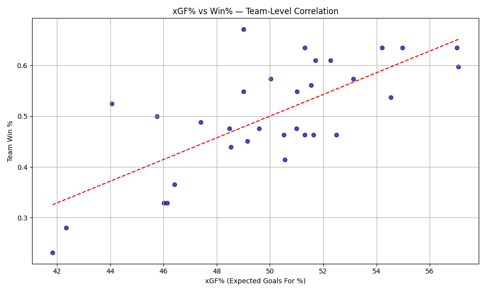
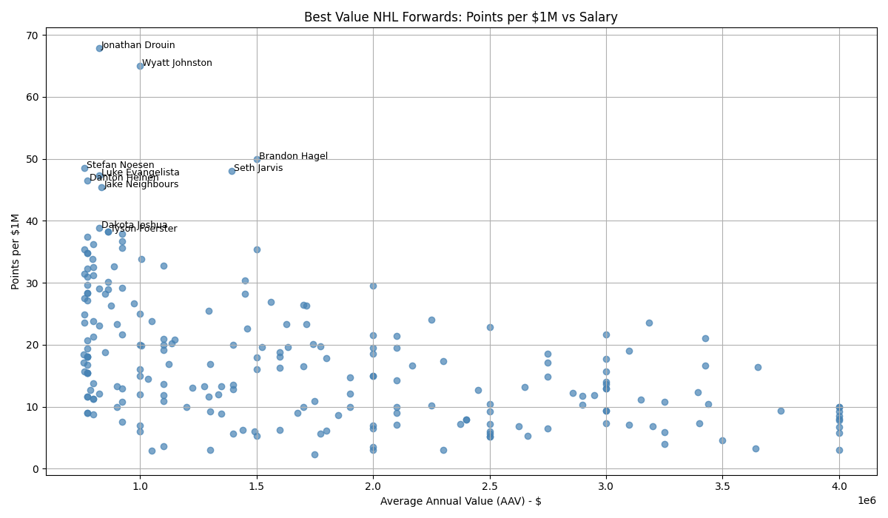
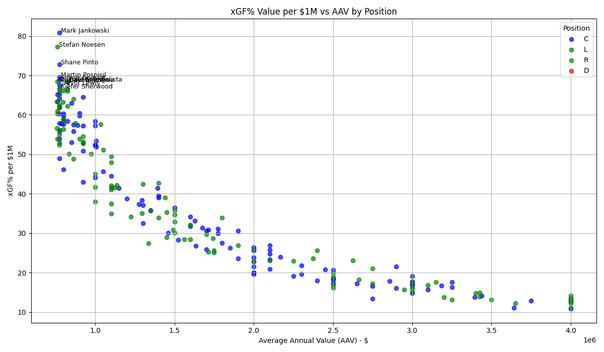
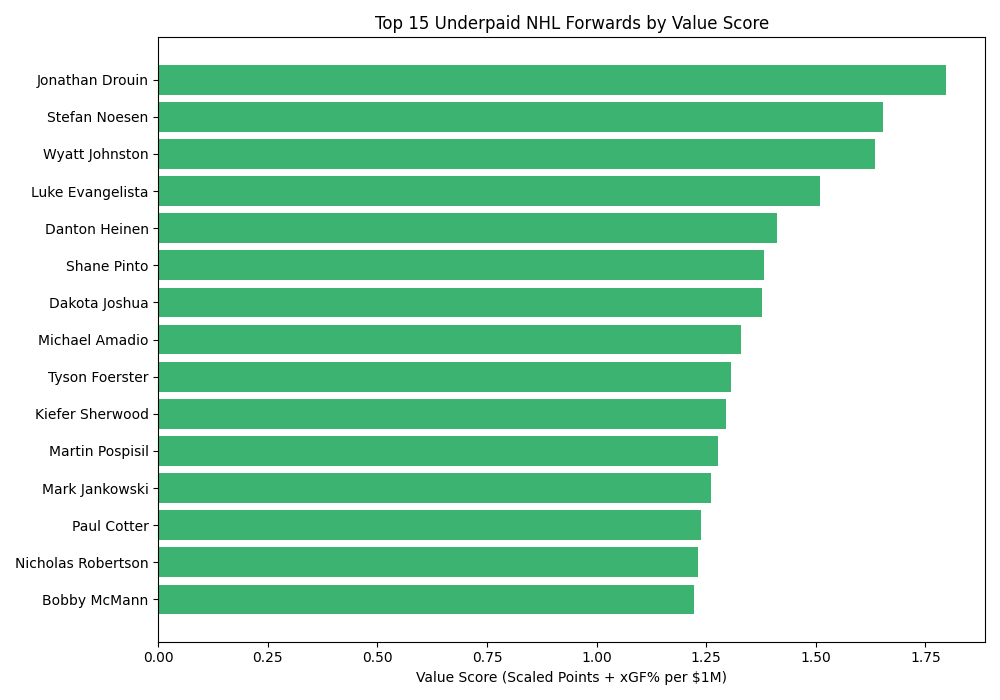

# NHL Value Forwards: Identifying Underpaid Players for Trade and Free Agency Targets

## Objective
Use NHL salary and performance data to identify **forwards who significantly outperform their contracts**, making them high-value targets for trades or free agency.

## Key Questions
- Which NHL forwards provide the most value per $1M of salary?
- How does play-driving (xGF%) relate to team success?
- What traits or metrics define an "undervalued" player?

##  Why It Matters
Teams constantly seek low-cost, high-impact players to build depth and stay under the cap. Identifying these players through data-driven analysis can give front offices a competitive edge.

## Project Structure
- `data/`: Raw and cleaned salary + performance data
- `notebooks/`: Data cleaning, metric creation, and visualizations
- `visuals/`: Value charts and scatter plots
- `README.md`: Summary of methodology and findings

## Metrics Used
- **Points per $1M AAV** → offensive efficiency
- **xGF% per $1M AAV** → play-driving efficiency
- **TOI/GP, GP** → minimum usage thresholds
- **R² = 0.53** → proven correlation between xGF% and Win%

## Tools
- Python (Pandas, Matplotlib)
- Google Colab
- GitHub for versioning

## Findings
- xGF% correlates strongly with team win% (R=0.728)
- Several players outperform their salary based on both production and play-driving
- Ideal trade/FA targets are often middle-six forwards under $4M

### Correlation: xGF% vs Win%

This scatterplot demonstrates the relationship between team xGF% and win percentage. With an R² of 0.53, this validates that xGF% is a reliable predictor of team success — supporting its use in player valuation.

### Points per $1M vs AAV

This chart shows which NHL forwards provide the most offensive production relative to their salary. Players in the top-left are producing high point totals on low-cost contracts — ideal trade or free agency targets.

### xGF% per $1M vs AAV

This chart highlights forwards who drive strong on-ice performance (xGF%) relative to their salary. xGF% is a strong predictor of team success, so these players offer high-impact value beyond just scoring.

### Top 15 Forwards by Combined Value Score

This bar chart ranks the most underpaid forwards in the NHL using a combined metric of scaled Points per $1M and xGF% per $1M. These players deliver elite production and play-driving efficiency relative to their cap hit.

Top 15 Based on Value Metric Data: [`data/top_15_value_targets.csv`](data/top_15_value_targets.csv)

This plot is based on players filtered by cap hit (≤ $4M), TOI/GP (≥ 8), and GP (≥ 30).  
Source data: [`data/final_value_targets.csv`](data/final_value_targets.csv)

## Future Work
- Add clustering by player archetype
- Visualize team-level value capture
- Introduce contract length, age curves, or playoff performance

## Data Sources
- Thank you to Natural Stat Trick for the in game analytic stats
- Thank you to PuckPedia for the Salary Stats

Full analysis notebook: [`notebooks/nhl_value_forwards.ipynb`](notebooks/NHL_Undervalued_Players_(1).ipynb)

